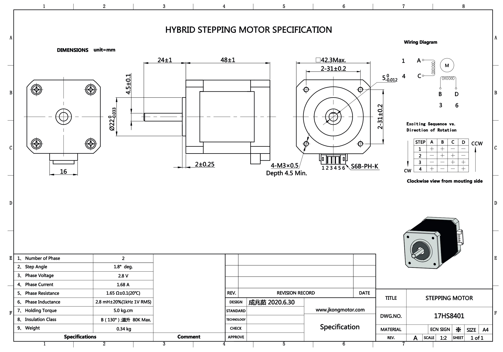

# Robot ja Sammmootor

- Stepper Motor 17HS8401
- Driver TB6600-4.0
- Arduino Uno

## Stepper Motor 17HS8401

4-wire, Bipolar stepper motor

### Pinout

- Red: A+
- Green: A-
- Yellow: B+
- Blue: B-

## Driver TB6600-4.0

- PUL+ Connect to the pulse signal (Arduino D2)
- PUL- Connect to the ground
- DIR+ Connect to the direction signal (Arduino D3)
- DIR- Connect to the ground
- ENA+ and ENA-: Optional enable signal (can be left disconnected if not used)

### Dip switches

- to configure the microstepping mode
- to set the current limit

|Micro step| S1| S2| S3|
|----------|---|---|---|
|        NC| ON| ON| ON|
|         1| ON| ON|OFF|
|       2/A| ON|OFF| ON|
|       2/B| ON|OFF|OFF|
|         4|OFF| ON| ON|
|         8|OFF| ON|OFF|
|        16|OFF|OFF| ON|
|        NC|OFF|OFF|OFF|

|Current (A)| S4| S5| S8|
|-----------|---|---|---|
|        0.5| ON| ON| ON|
|        1.0|OFF| ON| ON|
|        1.5| ON|OFF| ON|
|        2.0|OFF|OFF| ON|
|        2.5| ON| ON|OFF|
|        3.0|OFF| ON|OFF|
|        3.5| ON|OFF|OFF|
|        4.0|OFF|OFF|OFF|
